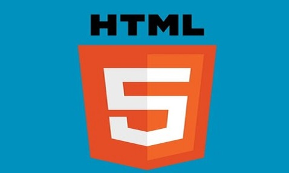
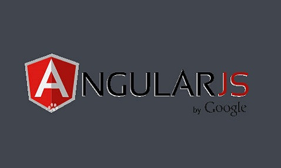
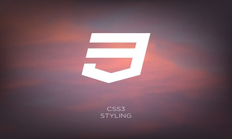

### 轮播图
方法：jquery框架
### html部分：
　　把轮播图（序号ul和轮播图banner_list）设置在id="banner"里面,代码如下
```html
<div id="banner">    
    <ul>
        <li class="on">1</li>
        <li>2</li>
        <li>3</li>
        <li>4</li>
    </ul>
   <div id="banner_list">
        <a href="#" target="_blank"></a>
        <a href="#" target="_blank"></a>
        <a href="#" target="_blank"></a>
        <a href="#" target="_blank"></a>
    </div>
</div>
```
### css部分：
1、选择轮播图的素材4张图，图的尺寸为478*286，给banner设置css，设置它的width为478px,height为286px,并且让超出banner的其他图隐藏起来，用```overflow:hidden```，并且为了让序号ul放在框的右下角，则让banner为```position:relative```,让#banner ul设置为```position:absolute```,然后可以设置，bottom,right,还有z-index。让ul序号横着排，因此要用到```float:left```。
2、导航ul序号，背景透明阴影，用```position:absolute```,然后设置```buttom:0```,让ul沉底。
### js部分
```javascript 
$("#banner_list a:not(:first-child)").hide();//使除了第一个图以外的图隐藏
$("#banner_info").html($("#banner_list a:first-child").find("img").attr('alt'));
//在banner_info上写上第一个图的属性alt的值
$("#banner_info").click(function(){window.open($("#banner_list a:first-child").attr("href"),"_blank")});
//通过点击banner_info的字体，打开相应的连接
$("#banner_info").unbind().click(function(){window.open($("#banner_list a").eq(i).attr('href'),"_blank")});
//先解开那句的绑定事件，然后绑定“当按后面的图的文字时打开链接”事件
$("#banner_list a").filter(":visible").fadeOut(500).parent().children().eq(i).fadeIn(1000);
//使得显示在浏览器的图片在点击图片序数后先渐渐消失，再使eq(n)的图片渐渐显示
if($("li").eq(i).attr('class')!='on')
	$(this).toggleClass("on");//使得没有点击的序号高亮，当点击已经高亮的图片序号时，继续高亮
$(this).siblings().removeAttr("class");//当点击其他序号时，使其他序号取消高亮
```
